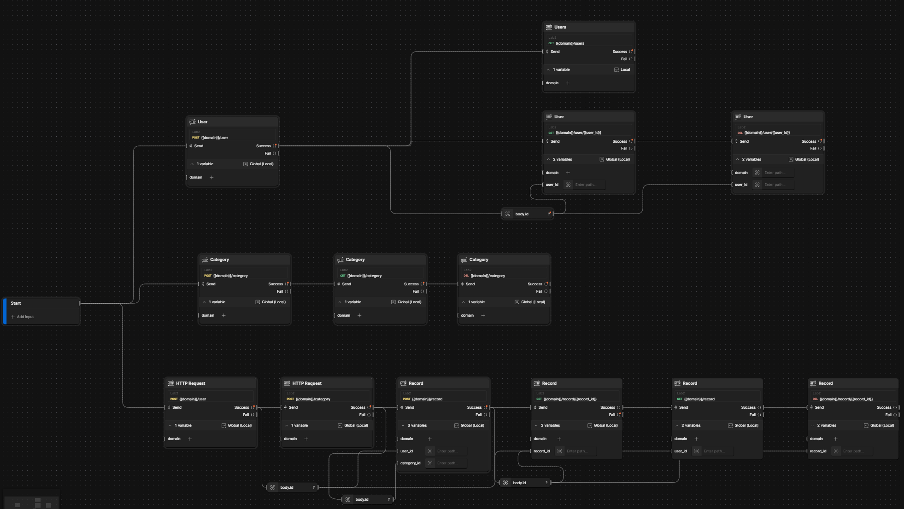

# BackendKPI-Lab2

## Local run:
`flask --app app:app run --host 0.0.0.0 --port 8080`

## Docker run:
```
docker build . -t lab1:latest
docker run -it --rm --network=host -e PORT=8080 lab1:latest 
```

or using docker-compose

```
docker-compose build
docker-compose up
```

## Endpoints:

### User
GET /user/<user_id>

DELETE /user/<user_id>

POST /user

GET /users

### Category

GET /category

POST /category

DELETE /category

### Record

GET /record/<record_id>

DELETE /record/<record_id>

POST /record

GET /record

## Postman Collection:

[Watch JSON File](./assets/Lab2.postman_collection.json)

## Postman Flow Schema:


